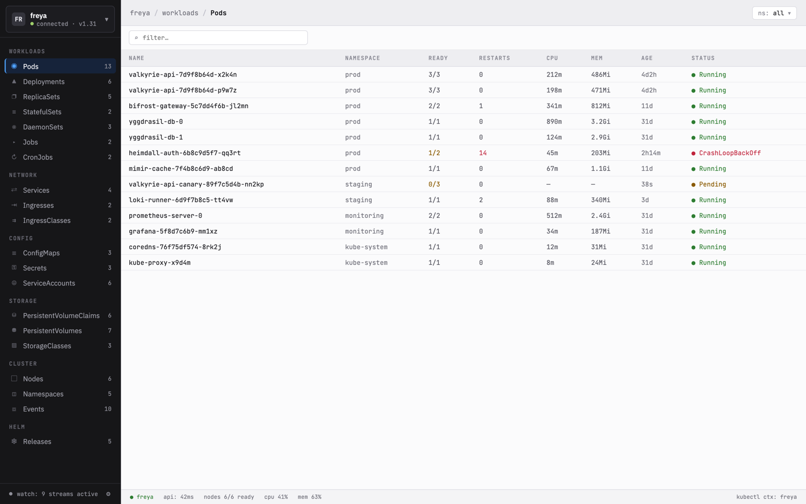
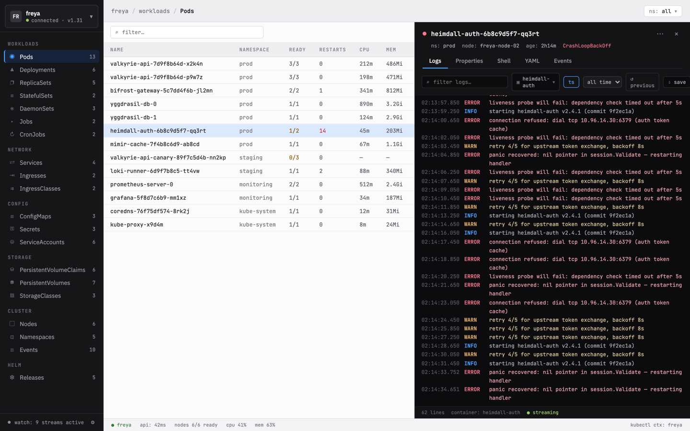
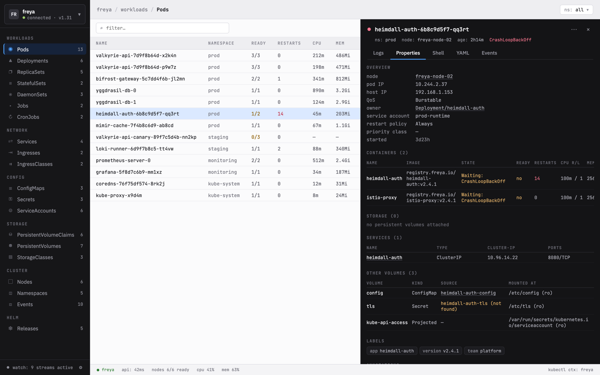
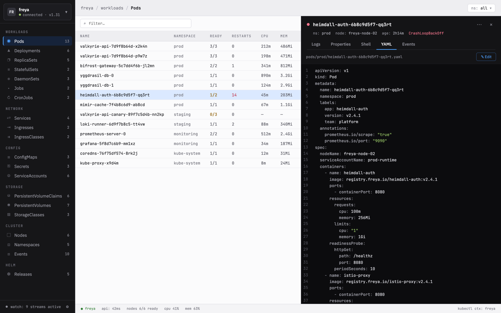
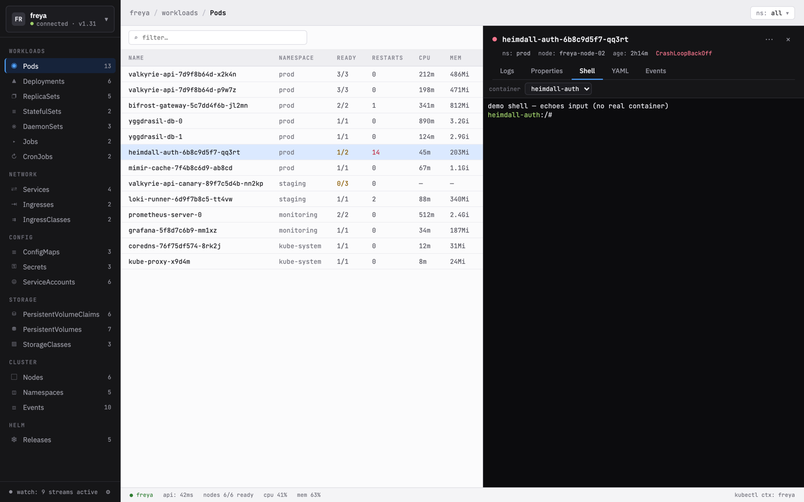
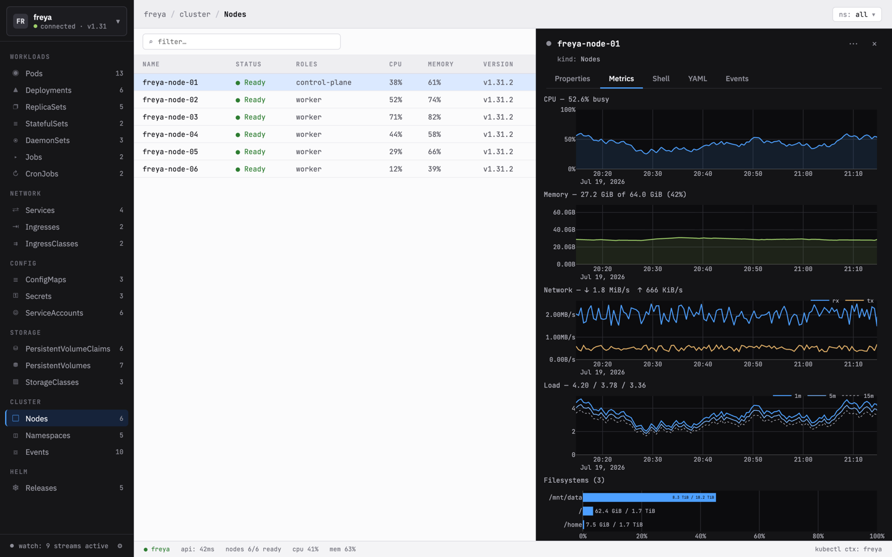

# k7s

A Lens-style **Kubernetes visual monitor** built as a [Tauri](https://tauri.app) desktop app — a Rust backend talking to the Kubernetes API, with a React + TypeScript frontend that recreates the design in [`design/`](design/).

Left navigation over all common resource kinds, live resource tables with namespace filtering, and a pod detail panel with **streaming logs**, **YAML view/edit/apply**, and **Events**.

> Design source of truth: [`design/README.md`](design/README.md) (exact tokens/spacing) and the interactive prototype [`design/K8s Monitor.dc.html`](design/). See [`plan.md`](plan.md) for architecture and [`tasks.md`](tasks.md) for the epic/story breakdown.

## Screenshots

Captured from demo mode, so the data is the stable fixture set rather than a real
cluster. Regenerate with `pnpm dev:shots` (see [`dev/shots.mjs`](dev/shots.mjs)).



*The resource table: 22 built-in kinds plus discovered CRDs, with live counts and
backend-driven status colouring.*



*Log streaming with follow/pause, a container cycler, since-windows and
save-to-file. Levels are parsed and toned, so a crash loop reads at a glance.*



*The Properties view — "what is this actually wired to". References are links: the
owner resolves through the ReplicaSet to the Deployment. A reference that doesn't
resolve says so (`heimdall-auth-tls (not found)`) instead of linking to a 404.*



*YAML view and edit. Applying runs a server-side dry run first and shows the diff
— defaulting and mutating webhooks included — before anything is written.*



*An interactive shell into a container. Nodes get one too, via a privileged debug
pod that `nsenter`s into the host's namespaces.*



*Node metrics from node-exporter, backfilled from Prometheus when the cluster runs
one. Filesystems are sorted fullest-first.*

## Features

- **Cluster switcher** fed by your kubeconfig contexts; switching tears down and rebuilds all live streams. **Import kubeconfig** adds contexts from any kubeconfig file via a native file picker (defaulted to kubectl's `~/.kube/config`), and they connect via their source file.
- **22 resource kinds** watched live across Workloads, Network, Config, Storage and Cluster — plus any **CRDs** the cluster defines, discovered on connect and watched *lazily*, so a cluster with hundreds of CRDs doesn't open hundreds of streams. Sidebar counts and a "watch: N streams active" footer.
- **Resource tables** with per-kind columns, namespace filtering, label-selector filtering (`app=web,tier=api`), sorting, and status coloring driven by the backend. Large tables are windowed.
- **Detail panels** for every kind: follow/pause **log streaming** (container cycler, interleaved multi-container, `previous`-container reads for crash loops, since-windows, save-to-file), **YAML** view/edit/apply, **Events**, and a **Properties** view answering "what is this actually wired to".
- **Related-resource navigation** — references are links. A pod's owner resolves *through* its ReplicaSet to the Deployment; a claim opens its volume; an event opens the object it's about. A reference that doesn't resolve says so instead of linking to a 404.
- **Interactive shell** into a container (xterm.js), and **port-forwarding** for pods and Services. Nodes get a **root debug shell** too — a privileged pod pinned to the node that `nsenter`s into the host's namespaces, behind an explicit consent screen and with a server-side deadline so it can't outlive the app.
- **Actions**: scale, restart (pod delete-and-recreate, or a workload rollout restart), cordon/uncordon, drain (eviction-based, so PodDisruptionBudgets are honoured), delete — each with the confirmation its blast radius deserves. Reachable from the detail panel or a **row context menu**, with shift/⌘-click **multi-select** for bulk deletes and cordons; bulk confirmations enumerate exactly what they'll act on.
- **Helm releases** decoded straight from their storage Secrets — overview, full revision history, and values with credential keys redacted in Rust.
- **Node metrics** plotted from node-exporter, backfilled from **Prometheus** when the cluster runs one.
- **Command palette** (⌘K) with fzy-style fuzzy ranking over kinds, objects and actions.
- **Light and dark themes**, following the OS by default. Light mode keeps a bright work area with dark side panels; the terminal and charts resolve their colours from the live design tokens rather than a hardcoded copy.
- **Status bar** with API latency, nodes ready, and cluster CPU/MEM % (via `metrics.k8s.io`, degrading to `—` when metrics-server is absent).

## Prerequisites

- **Node** ≥ 20 and npm
- **Rust** (stable) + the [Tauri v2 prerequisites](https://tauri.app/start/prerequisites/) for your OS
- A working **kubeconfig** to run against a real cluster (optional — see demo mode)
- For the fixture cluster: [`kind`](https://kind.sigs.k8s.io/) + `kubectl`

## Getting started

```bash
npm install

# Demo mode — runs the whole UI in a plain browser with the prototype's mock data,
# no cluster or Rust build needed. Best for UI work / pixel comparison.
VITE_DEMO=1 npm run dev        # → http://localhost:1420

# Same, but with the pods table padded out to 5000 synthetic rows — the fixture
# for checking that large tables still scroll smoothly (B21).
VITE_DEMO=1 VITE_STRESS=5000 npm run dev

# Real app — Rust backend + webview against your current kubeconfig context.
dev/run.sh                     # preferred; see below
npm run tauri:dev              # raw equivalent
```

### `dev/run.sh` — why not just `npm run tauri:dev`?

Because `tauri dev` can silently show you a **stale build**. It serves the webview
from `devUrl` (localhost:1420), but `tauri.conf.json` also declares
`frontendDist: "../dist"`. If vite isn't actually up on 1420 — a previous run left
an orphan holding the port, or vite died — the window can come up rendering
whatever `npm run build` last produced. It looks like the app, with features
mysteriously missing. We lost real time to this twice: it reads as "my code is
broken" when in fact your code was never loaded.

`dev/run.sh` makes that state unreachable. It stops any previous k7s dev
processes (matched to *this* repo — it will never touch another project's vite),
refuses to start if something else owns port 1420 rather than killing a stranger,
deletes `dist/` so there's nothing stale to fall back to, and watches vite for as
long as the app runs — if vite dies, it says so and stops the app instead of
leaving you debugging a ghost.

```bash
dev/run.sh                                   # current kubeconfig context
KUBECONFIG=/path/to/kubeconfig dev/run.sh    # a specific one
```

### Demo mode vs. real mode

The frontend talks to a `DataProvider` interface with two implementations
(`src/providers/`): a **MockProvider** (demo mode, `VITE_DEMO=1`) that replays the
prototype's data, and a **TauriProvider** that invokes the Rust backend. Components
never reference either directly, so the entire UI can be developed and pixel-checked
against the design without a cluster.

## Keyboard shortcuts

| Key | Action |
|---|---|
| `j` / `↓`, `k` / `↑` | Move the row highlight down / up |
| `Enter` | Open the highlighted row's detail |
| `g g` / `G` | Jump to the first / last row |
| `/` | Focus the table filter |
| `Esc` | Close an open menu → else clear a multi-row selection → else clear the filter → else close the detail panel |
| Shift-click / ⌘-click | Extend / toggle the row selection; right-click for the actions menu |
| `[` / `]` | Cycle the detail panel's tabs |

Shortcuts are ignored while typing in a field (filter, log search, YAML editor).

## Fixture cluster

To exercise the real backend end-to-end, bring up a local `kind` cluster seeded with
a realistic spread of workloads (including a CrashLoopBackOff pod, a Pending pod, and
a chatty multi-format logger):

```bash
./dev/cluster/up.sh              # create cluster + apply manifests
./dev/cluster/up.sh --metrics    # ...also install metrics-server (CPU/MEM columns)
npm run tauri:dev                # launch against context kind-k7s-dev
./dev/cluster/down.sh            # tear it all down
```

## Testing

```bash
npm run typecheck                          # tsc --noEmit
npm test                                   # vitest (formatters, store/ring buffer)
cargo test  --manifest-path src-tauri/Cargo.toml   # DTO mapping, log parser, quantities
cargo clippy --manifest-path src-tauri/Cargo.toml --all-targets -- -D warnings
```

## Build

```bash
npm run tauri:build              # produces a native app/installer under src-tauri/target
```

Output: `src-tauri/target/release/bundle/macos/k7s.app` (and a `.dmg`). Fonts are
bundled locally, so the app needs no network at startup, and the palette is chosen
before first paint (from a `localStorage` cache, since prefs load asynchronously)
so there's no flash of the wrong theme. Launching without a kubeconfig lands in a
clean disconnected state.

> The Tauri window's own `backgroundColor` is still the dark `#0d0d0f`, so
> launching *in light mode* shows a brief dark frame before the webview paints.
> That one is static config and can't follow the runtime theme.

> Note: the final `.dmg` styling step (`bundle_dmg.sh`) drives Finder/AppleScript
> and requires a logged-in GUI session — it fails in headless/CI environments even
> though the `.app` bundle itself builds fine. Build on a desktop session (or ship
> the `.app`) to get the `.dmg`.

## Project layout

```
design/                 # handoff (source of truth) — README + interactive prototype
plan.md · tasks.md      # architecture + epic/story breakdown
src/                    # React frontend
  providers/            #   DataProvider interface + Mock/Tauri implementations
  components/           #   sidebar · topbar · table · detail · statusbar
  store.ts · lib/       #   Zustand store, formatters, kind metadata, tone→color
src-tauri/              # Rust backend
  src/kube/             #   client · manager · watchers · mappers · logs · metrics
  src/commands.rs       #   Tauri commands (connect, get_yaml, start_log_stream, …)
dev/cluster/            # kind config + fixture manifests + up/down scripts
```

## Architecture at a glance

The Rust backend holds one active `kube::Client` and a registry of connection-scoped
tasks: one `watcher`/reflector per kind (emitting debounced row snapshots), a
metrics + status poller, and per-pod log streams. All are aborted on disconnect or
context switch. The frontend subscribes to Tauri events (`resource-update`,
`pod-metrics`, `cluster-status`, `watch-status`, `log-line:{id}`) and invokes
commands for one-shot operations. Status/coloring semantics live in the backend
(each cell carries a `tone`); the frontend maps tone → a design token. See
[`plan.md`](plan.md) for the full picture.

## Verification against a real cluster

Unit tests cover the pure logic, but a Kubernetes client is mostly about what a
real API server actually does. So `src-tauri/examples/*_check.rs` are **read-only
harnesses that run against a live cluster** and assert on it:

```bash
KUBECONFIG=/path/to/kubeconfig cargo run --example related_links_check
```

They're how several bugs were caught that no unit test would have found: a link
pointing at an `optional: true` Secret that didn't exist, a `previous`-container
log read that returns *identical* bytes to the live one while a container sits in
backoff, and an Ingress backend port that's a *name* rather than a number.

> The harnesses name the hosts and namespaces of the small self-hosted cluster
> this was built against, so they'll need adjusting for yours. The ones that
> discover their own fixtures (`storage_check`, `related_links_check`,
> `helm_props_check`, `promql_check`) run anywhere as-is.
