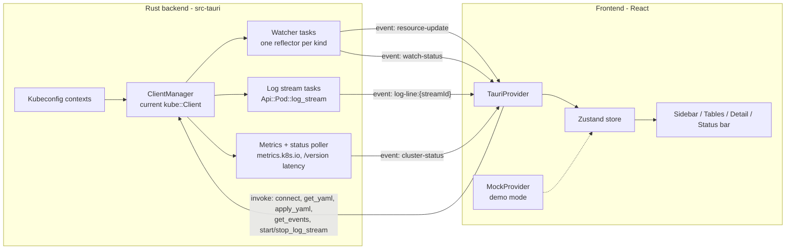

# k7s — Kubernetes visual monitor (Lens-style)

A dark, keyboard-light, single-window Kubernetes cluster monitor in the spirit of Lens, built as a **Tauri desktop app**: Rust backend talking to the Kubernetes API, React frontend recreating the handoff design **pixel-perfectly**.

**Design source of truth (do not deviate):**
- [design/README.md](design/README.md) — exact colors, typography, spacing, per-section specs (§1 Sidebar … §5 Status bar, Design Tokens).
- [design/K8s Monitor.dc.html](design/K8s%20Monitor.dc.html) — interactive prototype; open in a browser to compare behavior and look side-by-side. Its `class Component` script is the reference for mock data, column sets, status coloring, and interaction rules.

## 1. Scope

### In scope (v1)
- **Cluster switcher** fed by kubeconfig contexts; connect/disconnect, version display, context switching tears down and rebuilds all streams.
- **Left nav** over 12 resource kinds — Workloads: Pods, Deployments, StatefulSets, DaemonSets, Jobs, CronJobs · Network: Services, Ingresses · Config: ConfigMaps, Secrets · Cluster: Nodes, Namespaces — with live counts and a "watch: N streams active" footer.
- **Live resource tables** per kind (columns per prototype), namespace filter dropdown, live updates via Kubernetes watches.
- **Pod detail panel** (pods only, per design): streaming **Logs** (follow/pause, container cycler, timestamp toggle, client-side search, capped ring buffer), **YAML** (highlighted read view, edit + apply to cluster with inline errors), **Events** (field-selected for the pod).
- **Status bar**: connection dot, API latency, nodes ready, cluster CPU/MEM %, kubectl context.
- Metrics (pod CPU/MEM columns, node/cluster %) via `metrics.k8s.io`, degrading gracefully to `—` when metrics-server is absent.
- macOS packaging (primary dev target); Linux/Windows builds are best-effort.

### Out of scope (v1) — natural follow-ups
- Detail panel for non-pod kinds (design note: "extending YAML/Events to all kinds is a natural follow-up").
- Exec/shell into containers, port-forwarding, CRDs, Helm, multi-cluster simultaneous views, auth wizards (assume working kubeconfig).
- Settings UI (ring-buffer size etc. are code constants for now).

## 2. Tech stack

| Layer | Choice | Why |
|---|---|---|
| Shell | **Tauri v2** | Per handoff; small binary, Rust backend, webview frontend. |
| Backend | **Rust**: `kube` (client + runtime), `k8s-openapi` (latest supported feature gate), `tokio`, `serde_yaml`, `thiserror` | Handoff-suggested; `kube::runtime::watcher` powers live tables, `log_stream` powers logs. |
| Metrics | `metrics.k8s.io` via `kube` (e.g. `k8s-metrics` crate or raw API requests) | Pod CPU/MEM columns, node %, cluster %. Optional at runtime. |
| Frontend | **React + TypeScript + Vite** | Handoff default for Tauri; prototype is already React-shaped. |
| State | **Zustand** (single store) | State list is flat and enumerated in the handoff (§State Management); no need for heavier machinery. |
| Styling | **Plain CSS with custom properties** (tokens.css) + CSS Modules | The design is specified as raw CSS values; a 1:1 token file beats reinterpreting through a framework. |
| YAML view/edit | **CodeMirror 6** (yaml language), custom theme matched to the design tokens | Handoff explicitly suggests this for production-quality highlighting. |
| Fonts | **IBM Plex Sans** (400/500/600) + **JetBrains Mono** (400–700), bundled locally (e.g. `@fontsource/*` woff2) | Offline desktop requirement; no Google Fonts at runtime. |
| Icons | Unicode glyphs from the design (`◉ ▲ ≡ ⦿ ▸ ↻ ⇄ ⇥ ☰ ⚿ ▢ ◫ ⌕ ▼ ✓ ✎ ⏸ ▶ ●`) | Zero-dependency and exactly matches the prototype. Lucide swap is a follow-up. |

Don't pin exact crate/package versions in docs — use latest stable at implementation time.

## 3. Architecture



### 3.1 Rust backend (src-tauri)

**State**: a `ClientManager` holding the active `kube::Client`, the set of running watcher tasks, running log-stream tasks, and the metrics poller. Context switch = cancel everything, rebuild client, restart watchers, emit fresh snapshots.

**Commands (invoked from frontend):**

| Command | Signature (conceptual) | Notes |
|---|---|---|
| `list_contexts` | `() -> [{ name, cluster, current }]` | `kube::config::Kubeconfig::read()`. |
| `connect` | `(context) -> { context, clusterName, server, version }` | Builds client, probes `/version`, (re)starts all watchers + pollers. |
| `get_yaml` | `(kind, ns, name) -> String` | `serde_yaml::to_string`, strip `metadata.managedFields`. |
| `apply_yaml` | `(kind, ns, name, yaml) -> Result<(), String>` | Parse + `Api::replace` (server-side apply acceptable). Return the API error message verbatim for inline display. |
| `get_events` | `(ns, name) -> [EventItem]` | `Api::<Event>::list` field-selected on `involvedObject.name` + `involvedObject.namespace`; sorted newest-first; carry type/reason/message/count/lastSeen. |
| `start_log_stream` | `(ns, pod, container, tail?, sinceTime?) -> streamId` | `LogParams { follow: true, timestamps: true, container, tail_lines }`. Spawns a task forwarding parsed lines. |
| `stop_log_stream` | `(streamId)` | Aborts the task. Pause and panel-close both call this (per handoff: cancel on pause/close). |

**Events (emitted to frontend):**

| Event | Payload | Cadence |
|---|---|---|
| `resource-update` | `{ kind, rows: Row[] }` | On watcher change, **debounced ~150ms** per kind (full snapshot from the reflector store — simple and idempotent). |
| `pod-metrics` / `node-metrics` | `{ "ns/name": { cpuMillis, memBytes } }` | Poll every ~15s; omitted entirely if metrics API absent. |
| `cluster-status` | `{ connected, version, apiLatencyMs, nodesReady, nodesTotal, cpuPercent, memPercent }` | Every ~10s (latency = timed `/version` GET). |
| `watch-status` | `{ active }` | On watcher/log-stream start/stop → sidebar footer count. |
| `log-line:{streamId}` | `{ lines: [{ ts, level, msg }] }` | Batched ~80ms to avoid IPC spam. |
| `log-closed:{streamId}` | `{ reason }` | Stream ended/errored. |

**Row DTOs are computed in Rust**, matching the prototype's column sets exactly, so the frontend stays dumb. Shape: `{ uid, name, namespace?, creationTs, cells: [{ text, tone }], podMeta? }` where `tone ∈ default|muted|ok|warn|err` reproduces the prototype's coloring rules (Running/Ready/Active → green `●`, Pending → amber, CrashLoopBackOff/failed → red, ready `1/2` → amber, restarts >5 → red, etc.). Pods rows additionally carry `{ node, containers[], status, ready, restarts }` for the detail panel. **AGE is not a string from Rust**: send `creationTs`; the frontend formats k8s-style ages (`38s`, `2h14m`, `4d2h`, `31d`) and re-renders on a 30s tick.

**Log line parsing** (Rust side): split the RFC3339 timestamp prefix (from `timestamps: true`) into `HH:MM:SS.mmm`; detect level via heuristic — first match of `TRACE|DEBUG|INFO|WARN(ING)?|ERROR|ERR|FATAL|PANIC` (word-boundary, case-insensitive, scan first ~120 chars) or a JSON `"level":"…"` field; normalize to `DEBUG|INFO|WARN|ERROR`; no match → empty level (renders in the default color, column width preserved).

### 3.2 Frontend

**Provider abstraction** — one interface, two implementations:

```ts
interface DataProvider {
  listContexts(): Promise<ContextInfo[]>
  connect(ctx: string): Promise<ClusterInfo>
  onResourceUpdate(cb): Unsub
  onMetrics(cb): Unsub
  onClusterStatus(cb): Unsub
  onWatchStatus(cb): Unsub
  getYaml(ref): Promise<string>
  applyYaml(ref, text): Promise<void>        // rejects with API error message
  getEvents(ref): Promise<EventItem[]>
  startLogs(ref, container, opts, onLines, onClosed): Promise<LogHandle> // handle.stop()
}
```

- **`TauriProvider`** wraps `invoke`/`listen`.
- **`MockProvider`** ports the prototype's mock data verbatim (pods list, per-kind rows, log line pools incl. the CrashLoopBackOff pool, YAML generator, events, ~900ms log ticker). Activated by `VITE_DEMO=1`, letting the whole UI run in a plain browser via `npm run dev` — this is how pixel-fidelity gets verified without a cluster, and it doubles as a screenshot/demo mode.

**Store (Zustand)** mirrors the handoff's state list: `context, connection, nav, namespace, resourceRows (per kind), metrics, selectedPod, activeTab, logSearch, containerIndex, showTimestamps, following, logBuffer[], yamlEditing, yamlDraft, menusOpen, clusterStatus, watchCount`.

**Component tree** (maps 1:1 to design sections):

```
App
├─ Sidebar (§1)          ClusterSwitcher(+menu) · NavSection/NavItem(live counts) · WatchFooter(pulse)
├─ Main
│  ├─ TopBar (§2)        Breadcrumb(cluster/group/Kind) · NamespaceMenu(live namespaces + all)
│  ├─ ResourceTable (§3) sticky header · tone-colored cells · hover/selected rows · empty state
│  ├─ DetailPanel (§4)   Header(dot·name·×·meta) · Tabs
│  │   ├─ LogsTab        Toolbar(search·container·ts·follow) · Viewport(autoscroll) · FooterStrip
│  │   ├─ YamlTab        Toolbar(path·Edit/Cancel/Apply) · CodeMirror read/edit · error banner
│  │   └─ EventsTab      Event cards
└─ StatusBar (§5)
```

**Behavioral contract** (from handoff §Interactions): nav click switches kind and clears selection; pod row click opens detail and (re)starts the log stream; only one dropdown open at a time, close on selection and outside click; pause halts both stream consumption *and* auto-scroll; follow resumes with `sinceTime` = last line; ring buffer caps at 200 lines (constant); no animations except the 2s pulse on live dots.

## 4. Key decisions & risks

| Decision / Risk | Call |
|---|---|
| Full-snapshot events vs deltas | **Snapshots, debounced.** Idempotent, no reconciliation bugs; fine at hobby-cluster scale. Revisit only if a table exceeds ~5k rows. |
| Where coloring logic lives | **Rust emits `tone` per cell**; frontend just maps tone→token color. One source of truth for status semantics. |
| metrics-server absent | All metrics fields optional; UI renders `—` (prototype does this for Pending pods already). Status bar hides cpu/mem % when unknown. |
| RBAC gaps (forbidden kinds) | Watcher failure for a kind must not kill others: show `0` count and an empty table; log the error; keep retrying with backoff (watcher default). |
| Heterogeneous log formats | Level heuristic (above); unparseable lines still render (empty level). Never drop lines. |
| Secrets safety | Tables show names/metadata only; detail panel is pods-only in v1, so secret *values* never render. |
| Apply conflicts (409) | Surface the API error verbatim in an inline banner; user re-edits. No retry magic. |
| Window | Standard OS chrome (frameless optional per handoff — skipped), min 1280×800, **Tauri window background `#0d0d0f`** to avoid white flash. |

## 5. Milestones

| # | Deliverable | Epics (tasks.md) |
|---|---|---|
| M1 | Scaffold boots; tokens/fonts in; demo mode renders data through the provider seam | E1 |
| M2 | Real cluster: contexts list, connect, all 12 kinds watched, DTOs streaming | E2 |
| M3 | Full shell + live tables: sidebar, nav counts, ns filter, status bar, empty states | E3, E4 |
| M4 | Pod detail complete: streaming logs, YAML view/edit/apply, events | E5 |
| M5 | Context switching + resilience (disconnect, degraded metrics, stream errors) | E6 |
| M6 | Pixel-fidelity pass vs prototype, kind fixture cluster, tests green, packaged .app | E7 |

## 6. Verification strategy

- **Demo mode** (`VITE_DEMO=1`): pixel-compare every view against `design/K8s Monitor.dc.html` open in a browser side-by-side — same mock data makes differences pop.
- **Fixture cluster**: `dev/cluster/up.sh` creates a `kind` cluster + manifests replicating the prototype's world: multi-container deployments (app + sidecar), a StatefulSet, a **CrashLoopBackOff** pod (exercises red status, Warning events, ERROR logs), a **Pending** pod (unschedulable request), Jobs/CronJobs, Services, Ingress, ConfigMaps, Secrets, and optional metrics-server (`--kubelet-insecure-tls` patch for kind).
- **Automated**: `cargo clippy -D warnings`, `cargo test` (DTO mapping, log parsing, YAML roundtrip on fixtures), `tsc --noEmit`, `vitest` (age/unit formatters, log filter, ring buffer).
- **Manual QA checklist** lives in tasks.md E7.

## 7. Repo layout

```
k7s/
├─ design/                  # handoff (source of truth — read-only)
├─ plan.md · tasks.md
├─ src-tauri/               # Rust: main, commands.rs, kube/{client,watchers,logs,metrics,dto}.rs
├─ src/                     # React: app/, components/{sidebar,topbar,table,detail,statusbar}/,
│                           #   providers/{types,tauri,mock}.ts, store.ts, styles/tokens.css, lib/format.ts
└─ dev/cluster/             # kind config + fixture manifests + up.sh/down.sh
```
