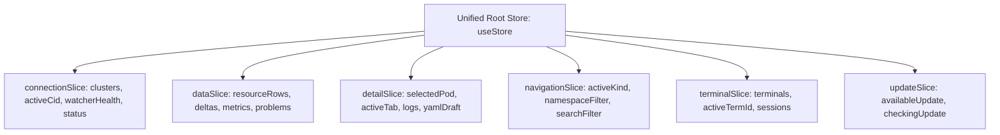

import { Callout } from 'nextra/components'

# Frontend State & Zustand

The k7s frontend (`src/`) is built with React 19 and uses **Zustand** as its centralized state management solution.

---

## Store Slice Architecture

To prevent store bloat and facilitate unit testing, the Zustand store is organized into modular slices (`src/store/`):

### 1. `connectionSlice.ts`
- Manages multi-cluster metadata, active cluster ID (`activeCid`), connection lifecycle state (`connected | connecting | stale | disconnected`), and per-kind watcher health status (`starting | live | backoff | forbidden | stopped`).

### 2. `dataSlice.ts`
- Holds resource rows keyed by cluster ID and resource kind: `resourceRows[cid][kind]: Map<uid, Row>`.
- Applies incoming `upsert` and `delete` deltas with minimal memory allocations.
- Computes aggregated **Problems** across workloads with memoization to avoid re-evaluating unchanged kinds.

### 3. `detailSlice.ts`
- Manages state for the currently opened detail panel: selected resource reference, active tab (`logs | properties | yaml | diff | events | metrics | topology | shell | nodeshell`), log stream filters, and YAML editing draft buffers.

### 4. `navigationSlice.ts`
- Stores current navigation view (e.g. `pods`, `deployments`, `overview`, `problems`), active namespace filter (`all` or specific namespace), and table search query strings.

### 5. `terminalSlice.ts`
- Manages cluster-scoped kubectl terminal tabs, active PTY process handles, and open state.

---

## Virtualization & Windowing Performance

In clusters containing 5,000 to 10,000+ pods, rendering every row in the DOM would degrade scroll performance and consume excessive memory.

k7s employs a lightweight, custom virtualization hook (`src/components/table/useVirtualRows.ts`):

- **Constant DOM Footprint:** Renders only the visible rows plus an overscan buffer (typically 30–45 DOM nodes total).
- **Zero Layout Shifts:** Uses absolute positioning with calculated translateY offsets based on a fixed row height (e.g. `32px`).
- **Granular Memoization:** Row components (`TableRow.tsx`) are wrapped in `React.memo`, preventing re-renders of rows whose cell values and tones have not changed.
