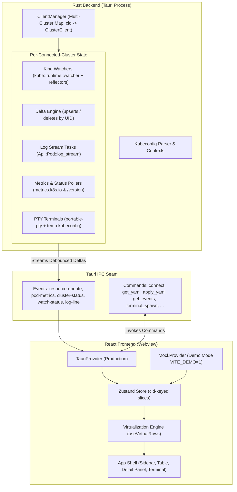

import { Callout } from 'nextra/components'

# System Overview & Architecture

k7s is structured as a two-tier desktop architecture: a **Rust backend** running inside the Tauri v2 process and a **React 19 + TypeScript frontend** running inside the native OS webview.

---

## High-Level Topology

---

## Architectural Principles

1. **Separation of Concerns via Provider Seam:** The frontend never directly imports Tauri IPC primitives. All data operations flow through a strict `DataProvider` interface. This allows running the entire application in a standard browser with synthetic mock data (`MockProvider`) during development or test execution.
2. **Multi-Cluster Concurrent Lifecycle:** Unlike traditional clients that tear down all state when switching clusters, k7s's `ClientManager` maintains concurrent cluster connections. Watch streams, terminal sessions, and port-forwards continue running in the background for connected clusters.
3. **Delta-Driven Updates:** To scale gracefully to clusters with over 10,000 objects, watchers accumulate change events and stream minimal `upserts` and `deletes` keyed by object `uid` rather than re-serializing massive full-snapshot arrays on every debounce tick.
4. **Backend-Driven Status & Coloring Semantics:** All complex Kubernetes status logic (waiting container reasons, exit codes, restart thresholds, ready counts, condition probes) is evaluated in Rust and serialized as a semantic `tone` (`default`, `muted`, `ok`, `warn`, `err`). The frontend remains dumb and maps tones directly to CSS design tokens.
5. **Zero Webview Leaks & Hardened Sandboxing:** Strict Content Security Policy (CSP), scoped Tauri capabilities, no dynamic HTML evaluation (`dangerouslySetInnerHTML` is strictly prohibited), and automatic sanitization of sensitive tokens in diagnostics.
